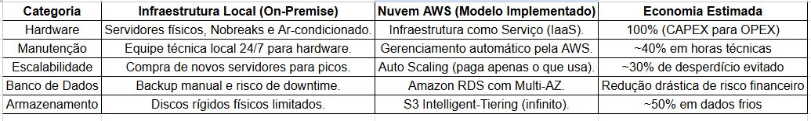

# RELATÓRIO DE IMPLEMENTAÇÃO DE SERVIÇOS AWS

**Data:** 30/03/2026  
**Empresa:** Abstergo Industries  
**Responsável:** Luciana Batista  

## Introdução
Este relatório apresenta o processo de implementação de ferramentas na empresa **Abstergo Industries**, realizado por **Luciana Batista**. O objetivo do projeto foi elencar 3 serviços AWS, com a finalidade de realizar diminuição de custos imediatos.

## Descrição do Projeto
O projeto de implementação de ferramentas foi dividido em 3 etapas, cada uma com seus objetivos específicos. A seguir, serão descritas as etapas do projeto:

### Etapa 1: 
- **Amazon EC2 (Instâncias Spot e Auto Scaling)**
- **Computação Elástica de Baixo Custo**
- **Descrição de caso de uso:** Migração do sistema de gestão de vendas para instâncias que escalam automaticamente conforme a demanda da farmácia. O uso de Instâncias Spot para processamento de relatórios de estoque gera uma economia de até 90% em comparação ao modelo tradicional.

### Etapa 2: 
- **Amazon S3 (Intelligent-Tiering)**
- **Armazenamento Otimizado de Objetos**
- **Descrição de caso de uso:** Armazenamento de receitas digitalizadas e documentos fiscais. A ferramenta move automaticamente arquivos pouco acessados para camadas de custo reduzido, eliminando a necessidade de gestão manual e reduzindo a conta de armazenamento mensal.

### Etapa 3: 
- **Amazon RDS (Relational Database Service)**
- **Banco de Dados Gerenciado**
- **Descrição de caso de uso:** Substituição de servidores físicos de banco de dados por uma solução gerenciada. Isso reduz custos com energia, refrigeração e manutenção de hardware, além de evitar prejuízos financeiros por indisponibilidade do sistema (downtime).

## Conclusão
A implementação de ferramentas na empresa **Abstergo Industries** tem como esperado a **redução drástica de gastos com infraestrutura física e a otimização do pagamento por uso real de recursos**, o que aumentará a eficiência e a produtividade da empresa. Recomenda-se a continuidade da utilização das ferramentas implementadas e a busca por novas tecnologias que possam melhorar ainda mais os processos da empresa.

## Anexos

* **Tabela Comparativa de Custos:** Projeção de economia entre Infraestrutura Local vs AWS.

* **Manual de Boas Práticas EC2:** Guia rápido para manutenção da eficiência em computação.
[Manual de Boas Práticas EC2](./anexo2.md)
* **Política de Retenção de Dados:** Regras de ciclo de vida para arquivos no S3.
[Política de Retenção de Dados](./anexo3.md)

**Assinatura do Responsável pelo Projeto:**
Luciana Batista